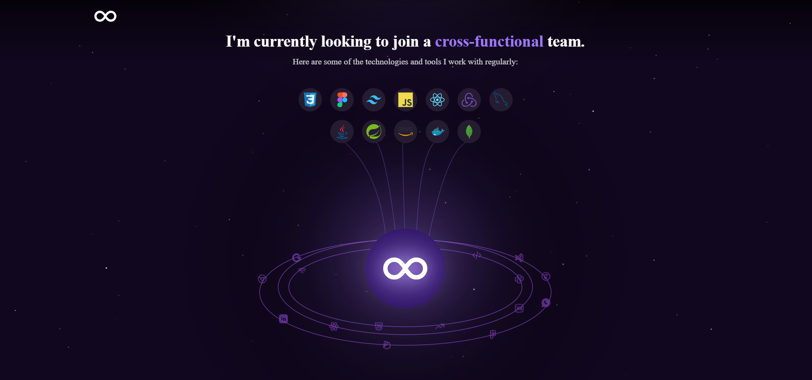

# Portfolio Website

A modern, responsive personal portfolio website showcasing my work, skills, and projects as a full-stack web developer and MCA student from Chandigarh, India. Designed to help recruiters and collaborators quickly understand my background and technical abilities.

- **Portfolio**: [Raaj Kumar](https://raajkumar.netlify.app/)

## 📋 Table of Contents

- [About](#about)
- [Screenshots](#screenshots)
- [Tech Stack](#tech-stack)
- [Contact](#contact)

## 🧑‍💻 About

I am an MCA student passionate about full-stack web development. This portfolio highlights my personal projects, coding journey, and demonstrating my technical skills and problem-solving abilities.

## 📸 Screenshots

| View | Screenshot |
|------|------------|
| **Herosection** |  |
| **Fields** |  |
| **Technical Skills** |  |
| **Projects Section** |  |
| **Contact Us** |  |

## 🛠️ Tech Stack

- **Frontend**: HTML, CSS, JavaScript,  React.js
- **Backend**: Netlify function
- **Styling**: TailwindCSS with custom Merriweather font and color palette
- **Build Tools**: npm
- **Deployment**: [netlify(CI-CD) and neon(for database)]

## 📫 Contact

Feel free to reach out to me:

- **GitHub**: [Raajkr07](https://github.com/Raajkr07)
- **LinkedIn**: [Raj Kumar](www.linkedin.com/in/raajkumar07)
- **Email**: rajkumar07.dev@gmail.com

⭐ If you found this helpful, please consider giving it a star!